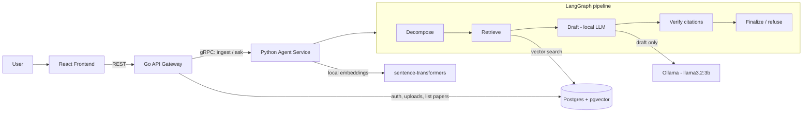
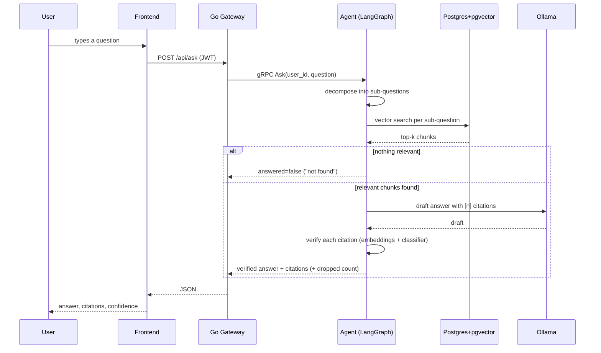

# CiteGraph

**Ask questions across a stack of research papers and get answers where every
citation is checked against its source before you see it — and where the system
says "the provided papers don't address this" instead of guessing.**

Most "chat with your PDFs" tools will happily produce a confident answer with a
citation stapled on, whether or not the cited passage actually says what the
answer claims. CiteGraph's whole point is the opposite: it drafts an answer with
a small local model, then **independently verifies each citation** (without
asking the model to grade its own work), drops any claim it can't support, and
refuses outright when the papers don't cover the question. It also ships a real,
self-measured accuracy number for that verification step — not a marketing
claim.

Everything runs locally and free: a local LLM via Ollama, local embeddings, and
Postgres+pgvector in Docker. No API keys, no sign-ups, no cloud.

---

## Quick start

You need **Docker Desktop** (no account required for local use). That's it.

```bash
git clone https://github.com/vppatel4/CiteGraph.git
cd CiteGraph
cp .env.example .env
docker compose up --build
```

Then open **http://localhost:5173**.

On the very first run the agent downloads a small embedding model (~90 MB) and
pulls the Ollama model (`llama3.2:3b`, ~2 GB). The health dot in the app's top
bar shows **"models warming up"** until that finishes, then turns to **"ready"**.

### Demo login

A demo account is seeded automatically so you can try it immediately without
registering:

| Email | Password |
|---|---|
| `demo@citegraph.dev` | `demo1234` |

(You can also create your own account from the login screen.)

### Ports

| Service | URL |
|---|---|
| Frontend | http://localhost:5173 |
| Gateway API | http://localhost:8080 |
| Agent health | http://localhost:8000/health |
| Postgres | localhost:5432 |
| Ollama | http://localhost:11434 |

---

## Demo


> _Placeholder — record a 60–90s walkthrough and drop it in at `docs/demo.gif`.
> See [docs/DEMO.md](docs/DEMO.md) for exactly what to capture and how._

**Demo checklist**

1. Log in with `demo@citegraph.dev` / `demo1234`.
2. Upload two or three research-paper PDFs (drag them onto the sidebar).
3. Ask something specific, e.g. _"What methods do these papers use to reduce false positives?"_
4. Read the answer and expand the citations — note the **confidence ring** and **verified** badge on each, and the exact section/page it points to.
5. Ask something the papers **can't** answer, e.g. _"What is the capital of France?"_ — confirm it refuses instead of guessing.
6. Open the **Evaluation** tab to see the real citation-verification numbers and the cannot-answer rate.

---

## How it works (plain language)

When you ask a question, it flows through five steps:

1. **Decompose** — if the question is broad (e.g. "compare X and Y"), a local
   model splits it into a couple of focused sub-questions. Simple questions pass
   through unchanged.
2. **Retrieve** — each sub-question is turned into a vector with a local
   embedding model, and we find the most similar chunks of your papers using
   pgvector inside Postgres. If nothing is even loosely relevant, we stop here
   and answer honestly that the papers don't cover it.
3. **Draft** — the retrieved chunks (numbered) and the question go to the local
   LLM, which writes an answer with inline `[n]` citation markers and uses
   bullet points for multi-part questions.
4. **Verify** — this is the important part. For every cited sentence we
   **independently** check whether the cited chunk actually supports it, using
   embedding similarity plus a small logistic-regression classifier — **we do
   not ask the LLM whether its own citations are right.** Claims whose citations
   all fail are removed; if nothing survives, the answer collapses to an honest
   "not found".
5. **Finalize** — you get the verified answer, the surviving citations (with
   paper, section, page, and a confidence score), and a count of anything the
   verifier dropped.

The LLM is deliberately kept on a short leash: it drafts, but it is never
trusted to judge whether it was right. That judgement is a separate, measurable
step.

---

## Architecture

Three services, plus the model runtime, run together with Docker Compose.



And the heart of the system, the "ask a question" flow:



### Tech stack — what's used where, and why

| Layer | Technology | Used for | Why this choice |
|---|---|---|---|
| API Gateway | Go | Routing, JWT auth, rate limiting, gRPC client | Fast, simple, and a clean systems-design story separate from the AI logic |
| Agent Service | Python + FastAPI | Hosting the AI pipeline (gRPC + health HTTP) | Best ecosystem for LangChain/LangGraph |
| Orchestration | LangChain + LangGraph | Decompose → retrieve → draft → verify pipeline | Real multi-step agent behaviour, not one prompt call |
| Embeddings | sentence-transformers (local) | Turning chunks and questions into vectors | Free, local, no API dependency |
| LLM | Ollama (`llama3.2:3b`) | Drafting answers from retrieved chunks | Zero-cost, zero-signup, fully local |
| Vector storage | PostgreSQL + pgvector | Storing chunks/embeddings and similarity search | Free, runs entirely in Docker, no hosted account |
| PDF parsing | PyMuPDF | Extracting text from uploaded papers | Reliable, free, well-documented |
| Frontend | React + Vite | Upload, ask, citations, eval dashboard | Lightweight, fast local dev loop |
| Verifier | scikit-learn (logistic regression) | Independently checking citations | Interpretable, tiny, and beats a plain threshold (see below) |
| Testing/CI | pytest, Go testing, GitHub Actions | Unit tests + compose smoke test on push | Free on public repos, never deploys anything |

A deeper, plain-language design write-up (why two services, why LangGraph, why
pgvector, etc.) is in [docs/ARCHITECTURE.md](docs/ARCHITECTURE.md).

---

## Evaluation (real numbers)

The citation verifier is scored against a hand-labeled set of 48
`(claim, source passage, verdict)` examples — half genuinely supported, half not,
including **hard negatives** that look similar but say something different (wrong
number, opposite direction, different subject). Two methods are compared: a plain
similarity threshold (the baseline) and the logistic-regression classifier. The
classifier is scored with 5-fold cross-validation so it's never tested on data it
trained on.

| Method | Accuracy | Precision | Recall | F1 |
|---|---|---|---|---|
| Baseline (similarity ≥ 0.45) | 0.708 | 0.656 | 0.875 | 0.750 |
| **Classifier (logistic regression)** | **0.812** | **0.800** | **0.833** | **0.816** |

The classifier wins mainly on **precision** (0.80 vs 0.66): the threshold gets
fooled by passages that are topically similar but don't actually support the
claim, while the classifier uses keyword and numeric-overlap features to catch
them.

There's also a separate **anti-hallucination** check: a set of questions the
papers genuinely can't answer, where the system must refuse. That number is
produced by running those questions through the live pipeline (see
`make eval -- --live`) and reported in [eval/results.md](eval/results.md).

Regenerate everything with:

```bash
make eval
```

---

## Running the tests

```bash
make test          # python + go unit tests (in containers)
make smoke         # end-to-end test against a running stack
```

CI runs the Python unit tests, the Go unit tests + `go vet`, the frontend build,
and a Docker Compose smoke test on every push — and never deploys anything.

---

## Project layout

```
gateway/        Go API gateway (auth, uploads, rate limiting, gRPC client)
agent-service/  Python FastAPI + LangChain/LangGraph
  ingestion/    PDF parsing, chunking, embeddings, pgvector storage
  graph/        LangGraph pipeline nodes + citation verification
  eval/         features, baseline, classifier, scoring
eval/           hand-labeled sets + generated results
frontend/       React (Vite) app
proto/          shared gRPC contract
db/             Postgres schema + pgvector setup
docs/           architecture + demo notes
docker-compose.yml
```

---

## Optional: faster answers with Groq

The default is fully local (Ollama), which needs no account. If you later want
faster drafting and don't mind creating a free Groq account, you can point the
draft step at Groq's OpenAI-compatible endpoint. This is **optional and not
required** — the project is designed to run with zero external services. See the
note in [docs/ARCHITECTURE.md](docs/ARCHITECTURE.md#optional-groq).

---

## Limitations / what I'd improve with more time

- **Section detection is rule-based.** It handles normal papers well but can
  mislabel unusual layouts (two-column scans, heavy tables). A layout-aware
  parser would help.
- **The classifier is small on purpose.** 48 labeled examples and five features
  is enough to beat the threshold and stay explainable, but more labeled data
  (and a held-out test set separate from the tuning set) would give a firmer
  number.
- **Verification is per-line.** A single bullet with two claims is checked as
  one unit, so a mostly-right bullet can keep a weak sub-claim. Sentence-level
  splitting would be stricter.
- **One local model.** `llama3.2:3b` is chosen to run on a normal laptop;
  drafting quality would improve with a larger model or the optional Groq path.
- **No re-ranking.** Retrieval is plain top-k cosine; a cross-encoder re-ranker
  would improve which chunks reach the draft step.
